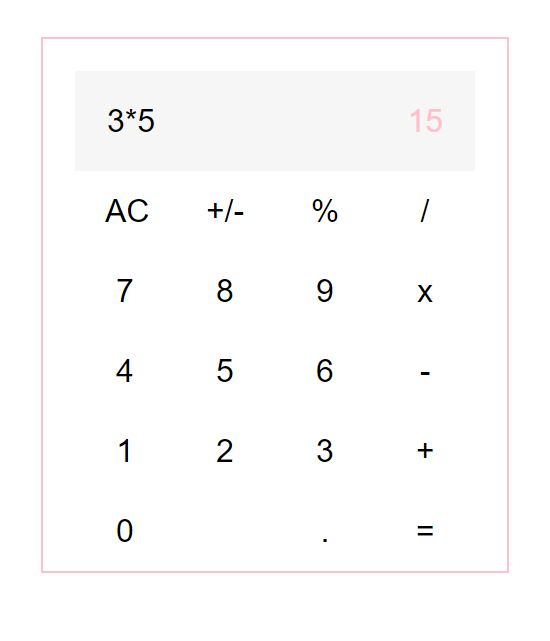

# 🖩 calculette

**calculette** is a simple calculator app built with React, Sass and Webpack.

## Installation

Clone the project and use the package manager npm to install calculette and its dependencies.

## Usage

  

## Contributing
To do:
- [ ] fix wrong input edge case
- [ ] fix decimals edge case

## License
[MIT](https://choosealicense.com/licenses/mit/)